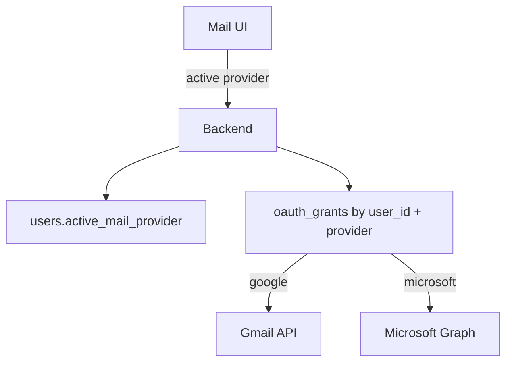

# Multi-provider mail (Gmail + Outlook)

## How this is understood

One **Benchute user account** can connect **one or more mail providers**:

| Provider key (DB) | Product | API |
|-------------------|---------|-----|
| `google` | Gmail | Gmail API |
| `microsoft` | Outlook / Microsoft 365 | Microsoft Graph |

Sidebar **Gmail** / **Outlook** switches which provider’s inbox you are looking at.  
That choice is stored as `users.active_mail_provider` and every mail API call uses that provider’s **oauth_grant** (tokens + scopes).

Sign-in can start with Google (today). Later: sign in with Microsoft, or link Outlook under the same user after Google login.

---

## Identity in the database

```
users
  id
  email                          -- primary profile email
  google_sub                     -- nullable (primary Google subject)
  microsoft_oid                  -- nullable (primary Microsoft subject)
  active_mail_provider           -- 'google' | 'microsoft'
  active_grant_id                -- selected oauth_grants.id
  ...

oauth_grants
  id
  user_id
  provider                       -- 'google' | 'microsoft'
  account_email                  -- mailbox identity (normalized)
  provider_subject               -- google sub / microsoft oid for that mailbox
  scopes_json
  refresh_token_enc
  access_token_enc
  access_expires_at
  revoked_at
  UNIQUE (user_id, provider, account_email)  -- many mailboxes per provider
```

**How the system knows Gmail vs Outlook**

1. Request includes session → load `user`.
2. Resolve mailbox via `user.active_grant_id` (must match provider) or first grant for provider.
3. Route to `GmailClient` or `OutlookClient` based on `grant.provider`.

Never guess from email domain alone. **Provider column is source of truth.**

See also: [`MULTI_ACCOUNT_ARCHITECTURE.md`](./MULTI_ACCOUNT_ARCHITECTURE.md) for multi-mailbox UX, logout persistence, and APIs.

---

## Flow (target)

```text
Login (Google or Microsoft)
    → upsert user
    → upsert oauth_grants row for that provider
    → set active_mail_provider
    → session cookie

Sidebar: [ Gmail ] [ Outlook ]
    → PATCH active_mail_provider
    → reload inbox via unified /api/mail/* (or provider-scoped routes)

Inbox / Compose / Reply / Delete
    → backend picks client from active provider + grant tokens
```



---

## What you need for Outlook (Azure / Entra)

Same shape as Google — register an app, get client id/secret, redirect URI, scopes.

### 1. Azure Portal
1. Go to [Azure Portal](https://portal.azure.com/) → **Microsoft Entra ID**
2. **App registrations** → **New registration**
3. Name: e.g. `Benchute Mail`
4. Supported accounts: **Accounts in any organizational directory and personal Microsoft accounts** (or org-only if you prefer)
5. Redirect URI (Web):  
   `http://localhost:4000/auth/microsoft/callback`

### 2. Copy these into `backend/.env` (when ready)
```env
MICROSOFT_CLIENT_ID=...
MICROSOFT_CLIENT_SECRET=...
MICROSOFT_REDIRECT_URI=http://localhost:4000/auth/microsoft/callback
MICROSOFT_TENANT=common
MICROSOFT_SCOPES=openid offline_access User.Read Mail.Read Mail.Send Mail.ReadWrite
```

| Value | Where |
|--------|--------|
| Client ID | App registration → Overview |
| Client secret | Certificates & secrets → New client secret |
| Redirect URI | Authentication → Web redirect URIs (exact match) |

### 3. API permissions (delegated)
Under **API permissions** → Microsoft Graph → Delegated:
- `openid`
- `profile`
- `email`
- `offline_access` (refresh tokens)
- `User.Read`
- `Mail.Read`
- `Mail.Send`
- `Mail.ReadWrite` (archive / delete / flags)

Click **Grant admin consent** only if you’re an admin for org accounts; personal MSA works with user consent.

### 4. Send me
- `MICROSOFT_CLIENT_ID`
- `MICROSOFT_CLIENT_SECRET`  
(put in `.env` yourself if you prefer not to paste secrets)

---

## Backend module layout (target)

```
auth/
  google.*          # existing
  microsoft.*       # start / callback / token refresh
mail/
  port.ts           # interface: list, get, send, action
  gmailAdapter.ts
  outlookAdapter.ts
  router.ts         # /api/mail/* uses active provider
```

Frontend stays dumb: one inbox UI; `provider` in `/auth/me` + sidebar switch.

---

## Phased delivery

| Phase | Work |
|-------|------|
| **Now** | Working Refresh; sidebar Gmail / Outlook switcher UI; DB columns for multi-provider |
| **Next** | Microsoft OAuth + Graph list/read (after you add Azure app) |
| **Then** | Outlook send / delete / archive parity |
| **Then** | Unify `/api/mail` so FE doesn’t care which provider |

---

## Google vs Microsoft (same mental model)

| | Google | Microsoft |
|--|--------|-----------|
| Consent | Google Cloud OAuth client | Entra app registration |
| Offline | `access_type=offline` | `offline_access` scope |
| Mail API | Gmail API | Graph `/me/messages` |
| DB key | `provider = 'google'` | `provider = 'microsoft'` |
